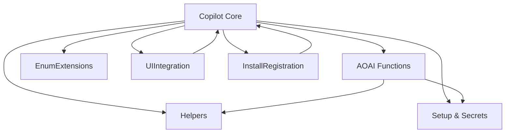

# Architectural Analysis

## High-Level Architecture

This extension follows a modular, function-based architecture designed for secure, AI-driven data exploration in Microsoft Dynamics 365 Business Central. The system is organized into logical modules, each with a clear responsibility and interface, supporting maintainability and extensibility.

### Main Logical Modules/Components

| Module/Component         | Purpose                                                                 | Key AL Objects (Top 5-10)                          |
|-------------------------|-------------------------------------------------------------------------|----------------------------------------------------|
| Copilot Core            | Orchestrates AI-driven data exploration and user interaction             | DataExplorerCapability.Codeunit.al, DataExplorerPrompt.Page.al, GenerationBuffer.Table.al |
| AOAI Functions          | Implements the function-based interface for AI (get_tables, get_fields, get_data) | GetTablesFunction.Codeunit.al, GetFieldsFunction.Codeunit.al, GetDataFunction.Codeunit.al |
| Helpers                 | Provides security, filtering, and error handling utilities               | TablePermissionHelper.Codeunit.al, FilterBuilder.Codeunit.al, DataExplorerErrorHandler.Codeunit.al |
| Setup & Secrets         | Manages configuration, secret storage, and setup UI                      | DataExplorerSetup.Table.al, DataExplorerSetup.Page.al, DataExplorerSecretInput.Page.al, DataExplorerSecretMgt.Codeunit.al |
| Install/Registration    | Handles capability registration and installation logic                   | DataExplorerInstall.Codeunit.al                    |
| Enum Extensions         | Extends Copilot capability enums                                         | CopilotCapabilityExt.EnumExt.al                    |
| UI Integration          | Integrates Copilot actions into the Business Manager Role Center         | BusinessManagerRCExt.PageExt.al                    |

## Component Interaction and Dependencies

- The **Copilot Core** module acts as the orchestrator, registering AOAI functions and handling user requests.
- **AOAI Functions** are registered as tools and invoked by the Copilot Core based on user intent.
- **Helpers** are called by both Copilot Core and AOAI Functions to enforce security, build filters, and handle errors.
- **Setup & Secrets** is accessed by Copilot Core for secure retrieval of configuration and API keys.
- **Install/Registration** ensures the capability is registered during installation.
- **Enum Extensions** and **UI Integration** provide extensibility and user entry points.

### Mermaid Component Diagram

## Key Design Patterns (Inferred)

- **Facade Pattern:** `DataExplorerCapability.Codeunit.al` acts as a facade, exposing a simplified interface for AI-driven data exploration.
- **Function-Based Interface:** AOAI Functions implement a common interface, supporting extensibility and modularity.
- **Singleton Pattern:** Setup and secret management codeunits (e.g., `DataExplorerSecretMgt.Codeunit.al`) are designed for single-instance usage.
- **Observer Pattern:** Event-driven registration and UI integration (e.g., install triggers, page extensions).
- **DTO Pattern:** `GenerationBuffer.Table.al` is used as a temporary data transfer object for AI result buffering.

## Potential Architectural Concerns / Anti-Patterns

- **God Object Risk:** The orchestrator codeunit (`DataExplorerCapability.Codeunit.al`) centralizes much logic; if it grows, it could become a god object.
- **Tight Coupling:** AOAI Functions are tightly coupled to the Copilot Core via direct registration, but this is mitigated by the function interface.
- **Lack of Cohesion:** No major issues observed; modules are well-separated by responsibility.
- **Circular Dependencies:** No circular dependencies detected; dependencies are unidirectional.

---
For data model analysis, see [04_data_model.md](./04_data_model.md).

---
[Previous: 02_codebase_structure.md](./02_codebase_structure.md) | [Next: 04_data_model.md](./04_data_model.md) | [Back to Index](./index.md)
