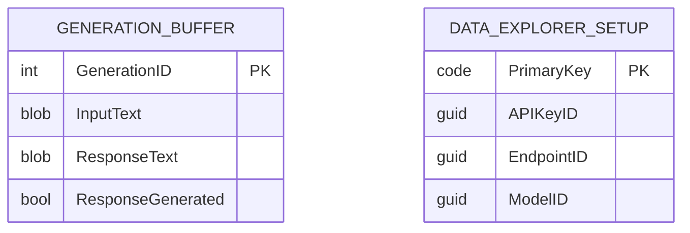

# Data Model Analysis

## Core Entities and Relationships

### Tables

| Table Name                | Object ID | Primary Key         | Significant Fields                                      |
|--------------------------|-----------|---------------------|---------------------------------------------------------|
| Generation Buffer         | 51300     | Generation ID       | Generation ID, Input Text, Response Text, ResponseGenerated |
| Data Explorer Setup       | 51301     | Primary Key         | Primary Key, API Key ID, Endpoint ID, Model ID          |

### Table Descriptions

- **Generation Buffer**: A temporary table used to buffer input and output text for AI-driven data generation. It stores the input text, the generated response, and a flag indicating if a response has been generated.
- **Data Explorer Setup**: Stores configuration and secret references for Azure OpenAI integration, including API key, endpoint, and model identifiers.

### Relationships

- There are no direct relationships between the custom tables. Each table serves a distinct, isolated purpose (buffering and configuration).

## Entity-Relationship Diagram (ERD)

## Key Enums and Option Fields

- No custom enums or option fields are defined in the current data model.

## Data Validation Logic

- **Data Explorer Setup**: Uses `TestField` in the `OnInsert` trigger to ensure the primary key is set. Additional procedures check for the presence of API key, endpoint, and model IDs.
- **Generation Buffer**: No complex validation; used as a temporary buffer for text data.

---
For key functionalities and business logic flows, see [05_key_flows.md](./05_key_flows.md).

---
[Previous: 03_architecture.md](./03_architecture.md) | [Next: 05_key_flows.md](./05_key_flows.md) | [Back to Index](./index.md)
