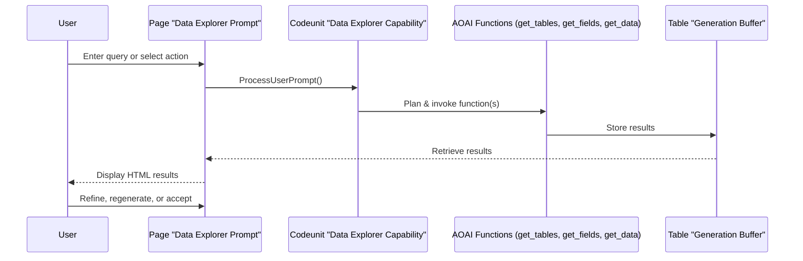

# Key Functionalities and Business Logic Flows

## Identification of Core Processes

The extension implements a single, critical business process: **AI-driven data exploration and retrieval** in Business Central, powered by Azure OpenAI and exposed through a conversational Copilot interface.

### Main User Workflow: Data Exploration with Copilot

#### Entry Points
- **Page:** `Data Explorer Prompt` (PromptDialog page)
- **Actions:** User enters a query or selects a guided action (e.g., "Show all tables", "Customer fields")

#### Sequence of Operations
1. **User Input:** User enters a natural language query or selects a guided action.
2. **Intent Processing:** The page calls `DataExplorerCapability.Codeunit.al` to process the intent.
3. **System Message & Planning:** The orchestrator sets up the system message and registers AOAI functions.
4. **Function Invocation:** Based on the query, the orchestrator invokes one or more of:
   - `get_tables` (table discovery)
   - `get_fields` (field metadata)
   - `get_data` (data retrieval)
5. **Permission & Filtering:** Each function checks permissions, applies filters, and paginates results.
6. **Result Buffering:** Results are stored in the `Generation Buffer` table.
7. **Display:** The page displays results as HTML in a web viewer.
8. **User Iteration:** User can refine the query, regenerate, or accept results.

#### Data Transformations
- User queries are transformed into structured function calls.
- Table/field/data metadata is retrieved, filtered, and formatted as HTML.
- Results are buffered for display and possible further processing.

#### Decision Points
- If the user query is ambiguous, the system plans which function(s) to call.
- If results are large, only the first 50 tables/fields or 100 records are shown, with filtering suggestions.
- If permissions are insufficient, user-friendly errors are displayed.

#### User Interaction
- Users interact via a prompt dialog page, with guided actions and free-form queries.
- Results are shown in a web viewer with professional formatting.
- Users can iterate, refine, or accept results.

## Flow Diagram: Data Exploration Sequence

---
For eventing and extensibility, see [06_eventing_extensibility.md](./06_eventing_extensibility.md).

---
[Previous: 04_data_model.md](./04_data_model.md) | [Next: 06_eventing_extensibility.md](./06_eventing_extensibility.md) | [Back to Index](./index.md)
