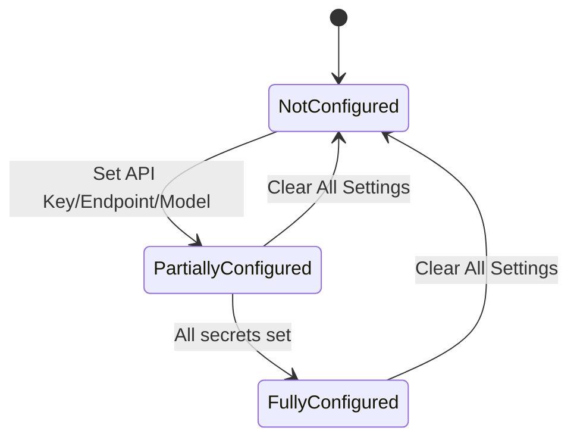
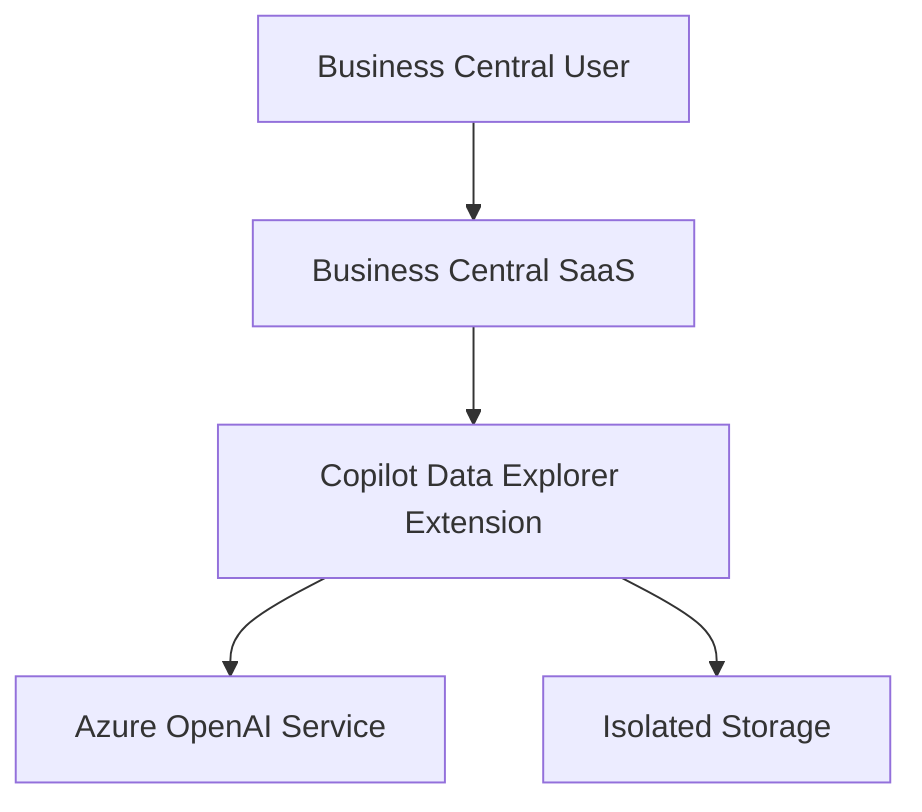
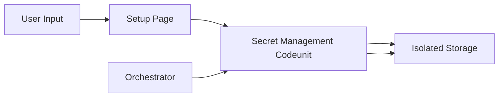
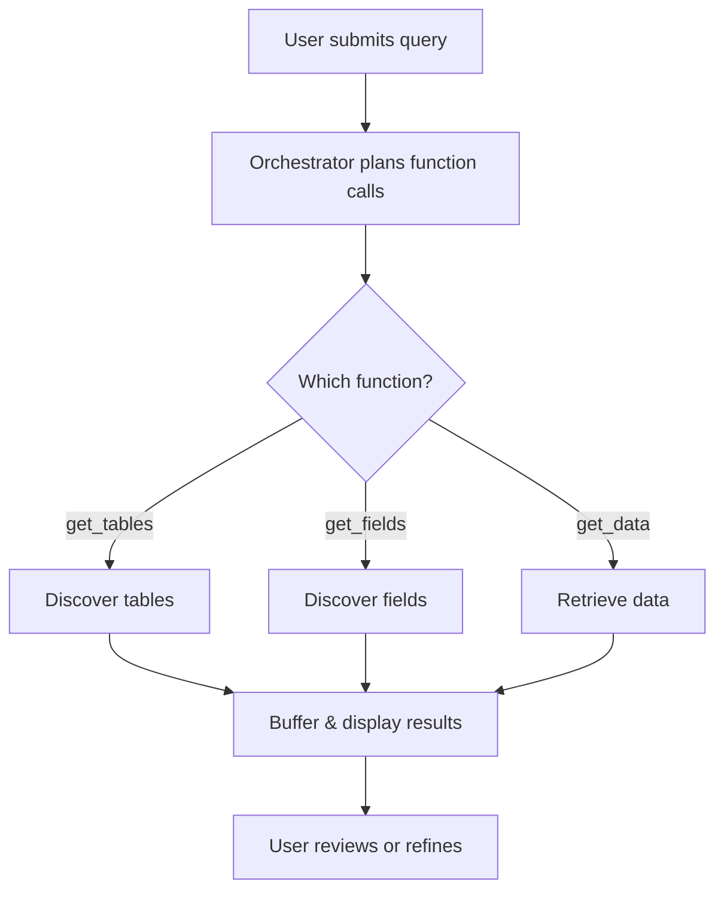

# Suggested Diagrams

Based on the architecture and flows of this extension, the following additional diagrams would be valuable for onboarding and deep understanding:

## 1. State Diagram: Data Explorer Setup Configuration
**Rationale:** Visualizes the states and transitions of the setup/configuration process, helping developers understand how the extension manages its configuration and secret state.

## 2. Deployment Diagram (Conceptual)
**Rationale:** Illustrates the deployment context, showing how the extension interacts with Business Central SaaS, Azure OpenAI, and isolated storage. Useful for architects and DevOps.

## 3. Data Flow Diagram: Secure Secret Management
**Rationale:** Shows the flow of secret data (API key, endpoint, model) from user input to secure storage and retrieval, clarifying security boundaries.

## 4. Activity Diagram: AI Query Handling
**Rationale:** Details the step-by-step activity from user query to AI response, complementing the sequence diagram with a focus on decision points and branching.

## 5. Component Responsibility Matrix
**Rationale:** Tabular diagram mapping each main component to its responsibilities, clarifying ownership and boundaries for maintainers.

| Component                | Responsibilities                                  |
|--------------------------|--------------------------------------------------|
| DataExplorerCapability   | Orchestration, planning, function registration    |
| GetTablesFunction        | Table discovery, metadata retrieval               |
| GetFieldsFunction        | Field metadata discovery                         |
| GetDataFunction          | Data retrieval, filtering, pagination            |
| TablePermissionHelper    | Permission validation                            |
| DataExplorerSecretMgt    | Secret storage and retrieval                     |
| DataExplorerSetup        | Configuration storage                            |
| GenerationBuffer         | Temporary result buffering                       |

---
For onboarding summary and next steps, see [10_onboarding_summary.md](./10_onboarding_summary.md).

---
[Previous: 08_code_quality.md](./08_code_quality.md) | [Next: 10_onboarding_summary.md](./10_onboarding_summary.md) | [Back to Index](./index.md)
